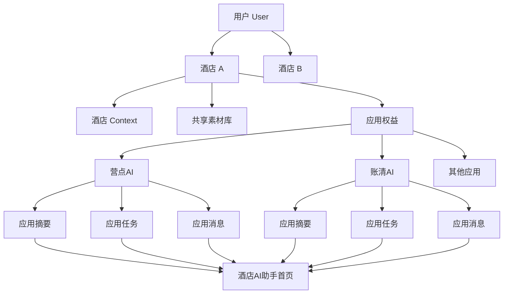
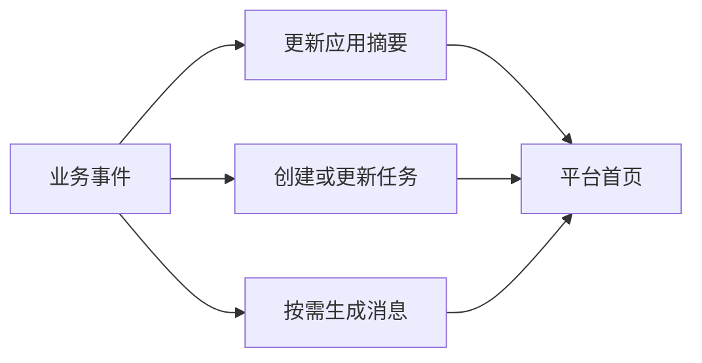

# 酒店AI助手平台 MVP PRD

## 1. 文档信息

| 项目 | 内容 |
|---|---|
| 产品名称 | 酒店AI助手 |
| 产品形态 | 微信小程序 |
| 版本 | MVP V1.0 |
| 产品阶段 | 多应用统一入口 |
| 核心导航 | 首页、我的 |
| 目标用户 | 单体酒店管理者、酒店运营人员 |
| 核心应用 | 营点AI、账清AI、行李寄存、酒店资讯、碰碰贴、吐槽码 |

---

## 2. 产品定位

酒店AI助手是一个以酒店为业务主体的AI应用平台。

MVP不建设完整智能体，也不建设复杂工作台，首先解决三个问题：

1. 用户可以统一管理多家酒店；
2. 用户可以进入酒店已经开通的应用；
3. 用户可以在首页看到各应用的摘要、待处理任务和重要消息。

一句话定义：

> 以当前酒店为上下文，聚合应用入口、应用摘要、应用任务和应用消息。

MVP不是单纯的应用货架，而是酒店各项应用的统一经营入口。

---

## 3. MVP目标

### 3.1 用户目标

用户进入小程序后，可以快速知道：

- 当前正在管理哪家酒店；
- 该酒店已经开通哪些应用；
- 各应用现在是什么情况；
- 有哪些事情需要处理；
- 最近发生了哪些重要事项；
- 应该进入哪个应用继续操作。

### 3.2 平台目标

- 建立统一的用户和酒店身份；
- 统一应用的数据归属；
- 建立应用接入规范；
- 为未来统一任务中心、消息中心和酒店智能体保留基础；
- 将营点AI现有的多酒店管理逐步迁移至平台。

### 3.3 MVP成功标准

- 用户完成注册后可创建第一家酒店；
- 一个用户可以管理多家酒店；
- 切换酒店后，首页内容同步更新；
- 应用可以接收平台传入的用户和酒店身份；
- 每个应用可以向平台返回摘要、任务和消息；
- 用户可以从首页直接进入对应业务页面；
- 不发生跨酒店的数据混用。

---

## 4. MVP范围

### 4.1 本期建设

- 手机号注册与登录；
- 用户身份 `user_id`；
- 酒店身份 `hotel_id`；
- 创建、编辑和切换酒店；
- 酒店基础 Context；
- 酒店共享素材库；
- 当前酒店记忆；
- 已开通应用入口；
- 应用摘要；
- 应用任务；
- 应用消息；
- 应用开通及有效期展示；
- 平台与应用间的统一跳转；
- “首页、我的”两级导航。

### 4.2 本期不建设

- `membership_id`；
- 酒店成员、岗位及权限；
- 应用市场独立频道；
- 平台作品中心；
- 平台统一成果中心；
- 独立任务中心；
- 独立消息底部频道；
- IM即时沟通；
- 跨应用AI建议；
- 自动调用多个应用；
- 完整知识图谱；
- 酒店智能体。

---

## 5. 核心业务结构



所有平台及应用数据必须明确绑定：

```text
user_id + hotel_id + app_id
```

---

## 6. 信息架构

```text
酒店AI助手
├── 首页
│   ├── 当前酒店
│   ├── 酒店切换
│   ├── 今日需要关注
│   ├── 已开通应用
│   │   ├── 应用摘要
│   │   ├── 优先任务
│   │   ├── 未读消息
│   │   └── 主操作
│   └── 可体验应用
│
└── 我的
    ├── 用户信息
    ├── 酒店管理
    │   ├── 酒店基础资料
    │   ├── 酒店 Context
    │   └── 酒店素材库
    ├── 应用与订阅
    ├── 订单与续费
    └── 客服与设置
```

---

## 7. 核心概念定义

### 7.1 当前酒店

当前酒店是用户在平台和应用中的默认业务空间。

切换当前酒店后，以下内容同步切换：

- 首页应用列表；
- 应用开通状态；
- 应用摘要；
- 应用任务；
- 应用消息；
- 酒店 Context；
- 酒店素材库；
- 应用额度；
- 应用业务数据。

平台记录用户最后一次选择的酒店，下次打开时默认进入该酒店。

### 7.2 酒店 Context

酒店 Context 是可以被多个应用读取的酒店公共业务资料。

MVP包括：

#### 基础信息

- 酒店名称；
- 所在城市；
- 酒店地址；
- 酒店Logo；
- 酒店介绍；
- 联系方式。

#### 营销信息

- 品牌色；
- 主推房型；
- 酒店卖点；
- 常用二维码；
- 常用宣传语；
- 内容风格偏好。

#### 服务信息

- 酒店设施；
- 酒店服务；
- 入住和退房时间；
- 早餐、停车等基础说明。

不同应用根据业务需要读取部分字段，不要求所有应用使用全部Context。

> 应用不读取酒店 Context，不代表业务数据不属于酒店。

例如营点AI的自由创作和模板创作可以不读取酒店资料，但生成记录、额度消耗和作品仍然绑定当前 `hotel_id`。

### 7.3 应用摘要

应用摘要回答：

> 这个应用现在整体是什么情况？

摘要是应用根据核心业务状态、重点任务和必要结果生成的一条当前结论，不是所有信息的简单拼接。

特点：

- 每个酒店、每个应用只有一条当前摘要；
- 新摘要覆盖旧摘要；
- 不存在已读或已完成；
- 点击后进入应用首页或对应结果页。

示例：

- 营点AI：本月已生成8个内容，还可生成12次；
- 账清AI：今日已核对126笔，发现3笔异常；
- 行李寄存：当前有6件行李寄存中；
- 吐槽码：今日收到2条住客反馈。

### 7.4 应用任务

应用任务回答：

> 用户现在需要做什么？

任务必须具备明确的处理动作和完成状态。

状态：

```text
待处理 → 处理中 → 已完成 / 已取消
```

示例：

- 确认1笔金额不一致账目；
- 处理1件超时未领取行李；
- 确认并发布本周宣传内容；
- 查看并处理1条严重投诉。

首页每个应用最多展示一条最高优先级任务，完整任务列表留在应用内部。

### 7.5 应用消息

应用消息回答：

> 应用最近发生了什么重要事情？

消息状态：

```text
未读 → 已读
```

消息用于：

- 长时间任务完成；
- 重要异常；
- 重要结果；
- 套餐及系统提醒。

示例：

- 宣传视频已经生成；
- 今日账清文件处理完成；
- 收到一条严重住客投诉；
- 碰碰贴设备已经恢复在线；
- 营点AI套餐将在7天后到期。

读取消息不等于完成关联任务。

### 7.6 业务事件

业务事件属于应用内部机制，不作为用户看到的第四类内容。



例如“账清发现3笔异常”可以产生：

- 摘要：今日发现3笔异常；
- 任务：其中1笔需要人工确认；
- 消息：今日账清文件处理完成。

不是每个事件都必须同时生成摘要、任务和消息。

---

## 8. 功能需求

### 8.1 注册与首次使用

#### 用户流程

1. 用户手机号登录；
2. 填写酒店名称、城市和本人职务；
3. 系统创建 `user_id`；
4. 系统创建第一条 `hotel_id`；
5. 设置该酒店为当前酒店；
6. 用户进入首页或来源应用。

#### 产品规则

- 不要求一次性填写完整酒店资料；
- 应用在实际使用时引导补充所需资料；
- 首次从营点AI进入的用户，完成注册后直接返回营点AI。

### 8.2 首页

首页主要由四部分组成。

#### A. 当前酒店栏

展示：

- 当前酒店名称；
- 所在城市；
- 酒店切换入口；
- 我的酒店管理入口。

切换酒店后，整个首页重新加载对应酒店的数据。

#### B. 今日需要关注

当存在重要任务时展示，最多显示3条：

```text
今日需要关注

账清AI：1笔异常需要确认
行李寄存：1件行李等待交接
吐槽码：收到1条严重反馈
```

排序规则：

```text
高优先级异常
→ 即将超时任务
→ 普通待处理任务
→ 进行中任务
```

没有任务时不强行占用首页空间。

#### C. 已开通应用

每张应用卡片展示：

| 内容 | 说明 |
|---|---|
| 应用名称与图标 | 识别应用 |
| 开通状态 | 体验中、已开通、即将到期 |
| 应用摘要 | 当前整体情况 |
| 最高优先级任务 | 有任务时显示 |
| 未读消息 | 仅显示数量或重点消息 |
| 主操作 | 进入最需要处理的页面 |

视觉层级：

```text
任务 > 摘要 > 消息
```

#### D. 可体验应用

MVP不建设完整应用市场，只在首页底部展示少量可体验应用。

展示：

- 应用名称；
- 一句话价值；
- 体验或查看按钮。

### 8.3 首页应用展示规则

| 应用 | 摘要示例 | 任务示例 | 消息示例 | 主操作 |
|---|---|---|---|---|
| 营点AI | 本月已生成8个内容 | 本周内容还未生成 | 宣传视频已生成 | 去创作 |
| 账清AI | 今日发现3笔异常 | 1笔账目待确认 | 今日文件处理完成 | 查看异常 |
| 行李寄存 | 当前6件寄存中 | 1件行李待交接 | 行李已被领取 | 查看记录 |
| 酒店资讯 | 今日新增8条资讯 | 3条资讯建议关注 | 今日资讯已更新 | 查看资讯 |
| 碰碰贴 | 3个设备正在使用 | 1个设备离线 | 设备恢复在线 | 管理设备 |
| 吐槽码 | 今日收到2条反馈 | 1条严重反馈待处理 | 收到新的住客反馈 | 查看反馈 |

### 8.4 我的

#### 用户信息

- 手机号；
- 姓名或昵称；
- 当前酒店；
- 退出登录。

#### 酒店管理

用户可以：

- 查看名下酒店；
- 新增酒店；
- 编辑酒店资料；
- 切换默认酒店；
- 管理酒店 Context；
- 管理共享素材库。

MVP不提供成员邀请和岗位权限。

#### 应用与订阅

按当前酒店展示：

- 已开通应用；
- 体验中应用；
- 应用有效期；
- 套餐剩余额度；
- 续费入口。

---

## 9. 平台与应用边界

| 平台负责 | 应用负责 |
|---|---|
| 用户身份 | 具体业务流程 |
| 酒店身份与切换 | 应用业务规则 |
| 酒店 Context | 应用专属资料 |
| 共享素材库 | 业务数据和记录 |
| 应用开通状态 | 详细结果页 |
| 应用入口 | 应用内任务列表 |
| 首页摘要聚合 | 摘要计算与生成 |
| 跨应用任务展示 | 任务创建与完成 |
| 重要消息聚合 | 消息内容生成 |
| 统一跳转和返回 | 业务操作和结果处理 |

核心原则：

> 平台负责身份、公共资料、入口、聚合和路由；应用负责领域业务、详细数据和完整操作。

---

## 10. 应用接入规范

### 10.1 平台传给应用

```text
user_id
hotel_id
entry_source
task_id（可选）
notification_id（可选）
target_page（可选）
```

应用根据 `hotel_id` 请求：

- 酒店 Context；
- 酒店素材库；
- 应用权益；
- 套餐额度。

### 10.2 应用返回平台

每个应用至少需要提供：

#### AppSummary

```text
hotel_id
app_id
summary
status_level
action_label
action_url
updated_at
```

#### AppTask

```text
task_id
user_id
hotel_id
app_id
task_type
title
summary
priority
status
action_url
created_at
due_at
```

#### AppNotification

```text
notification_id
user_id
hotel_id
app_id
notification_type
title
content
related_task_id
action_url
read_at
created_at
```

---

## 11. 酒店切换规则

### 11.1 首页切换

用户切换酒店后，全平台当前酒店发生变化，并重新获取对应酒店的数据。

### 11.2 应用内切换

应用内允许展示酒店切换入口，但必须调用平台统一酒店选择器。

应用不得单独维护另一套酒店列表。

### 11.3 从任务进入应用

任务跳转必须携带 `hotel_id`。

如果任务属于酒店B，而用户当前位于酒店A，系统提示：

> 该任务属于“酒店B”，是否切换后处理？

确认后切换酒店并进入目标任务。

### 11.4 业务过程中切换

以下场景不允许无提示切换：

- 正在编辑内容；
- 正在上传文件；
- 正在填写表单；
- 正在生成图片或视频；
- 正在处理账目。

系统应要求用户保存草稿或退出当前流程。

已经提交的任务始终归属于提交时的 `hotel_id`。

---

## 12. 营点AI迁移方案

营点AI现有的酒店管理逐步迁移到酒店AI助手。

### 12.1 迁移后职责

- 酒店AI助手负责酒店新增、编辑和切换；
- 营点AI读取平台当前酒店；
- 营点AI不再建立独立酒店身份；
- 原有酒店数据映射至平台 `hotel_id`；
- 原有作品、素材、额度和生成记录补充 `hotel_id`。

### 12.2 创作路径归属

| 创作方式 | 是否读取Context | 是否绑定酒店 |
|---|---:|---:|
| 基于酒店资料创作 | 是 | 是 |
| 自由描述创作 | 否 | 是 |
| 模板快速创作 | 可选 | 是 |

---

## 13. 异常与边界处理

- 酒店已删除或停用：禁止进入对应业务；
- 应用已到期：首页保留入口，主操作变为“续费”；
- 应用摘要请求失败：显示“暂时无法获取状态”，不显示错误数据；
- 任务已在应用内完成：首页刷新后移除；
- 消息已读但任务未完成：任务继续保留；
- 酒店Context缺失：应用按需引导补充；
- 用户无任何酒店：进入创建酒店流程；
- 用户无已开通应用：首页展示可体验应用。

---

## 14. 非功能要求

### 14.1 数据隔离

所有业务接口必须校验：

```text
当前 user_id 是否有权访问目标 hotel_id
```

应用不能仅凭前端传入的 `hotel_id` 返回数据。

### 14.2 性能

- 首页首屏目标加载时间不超过2秒；
- 摘要、任务和消息允许分模块加载；
- 单个应用异常不得阻塞其他应用展示。

### 14.3 可扩展性

- 平台不写死具体应用业务字段；
- 新应用通过统一协议接入；
- 任务、消息和摘要均必须包含 `app_id` 和 `hotel_id`；
- `membership_id` 后续可以加入，但不影响现有数据归属。

---

## 15. 验收标准

MVP上线前必须满足：

- 一个账号可以创建并切换多家酒店；
- 当前酒店在首页和应用内保持一致；
- 每个应用数据严格绑定酒店；
- 首页可以展示应用入口和应用摘要；
- 首页可以展示每个应用最高优先级任务；
- 用户可以从任务直接进入应用处理页面；
- 任务完成后首页状态正确更新；
- 重要消息可以展示未读状态；
- 已读消息不会误完成关联任务；
- 营点AI三种创作路径均绑定当前酒店；
- 应用过期、接口失败和酒店缺失均有明确兜底；
- 首页与“我的”形成完整使用闭环。

---

## 16. MVP结论

> 首页负责看应用、看情况、看待办；我的负责用户、酒店、Context、素材和订阅；具体业务全部进入应用完成。
